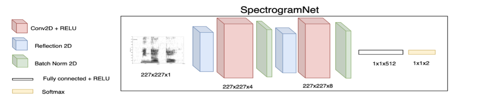
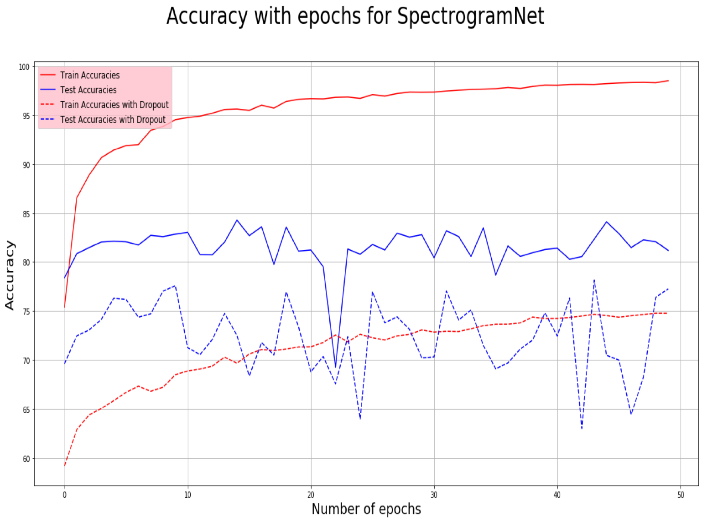
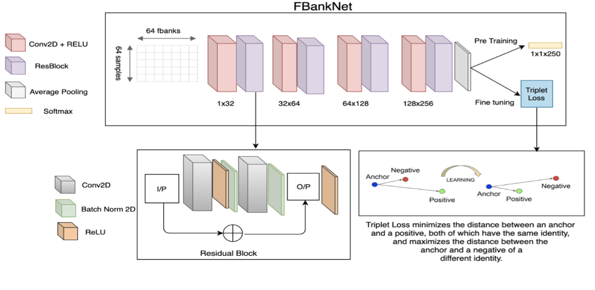
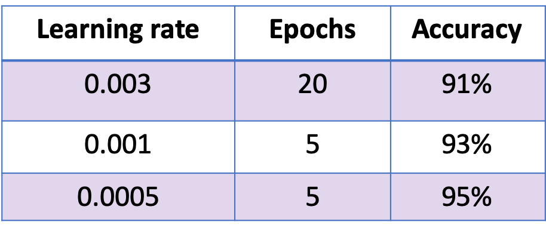
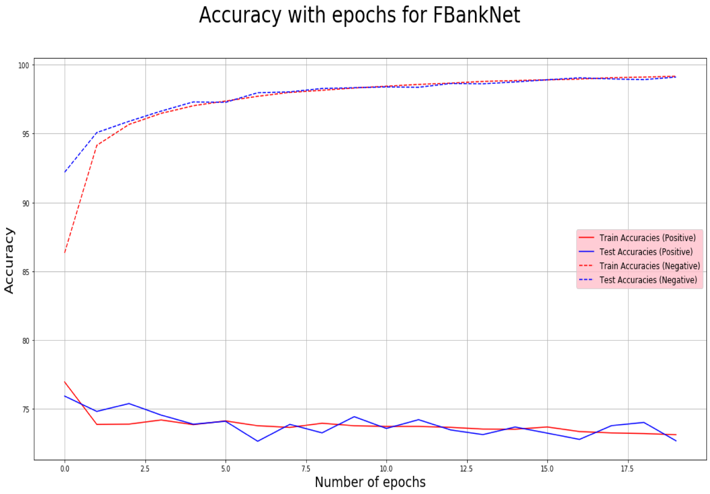

# You Only Speak Once
## One Shot Learning using Siamese Network for Speaker Recognition

## Introduction
Biometric authentication systems rely on some kind of visual input, such as fingerprints and Face ID. However, devices like Alexa only receive audio as input that can be leveraged for authentication.
Our project aims to develop a one shot learning based voice authentication system using siamese network. We intend to develop a neural speaker embedding system that maps utterances to a hyperspace where speaker similarity is measured by cosine similarity.  
## Related Work
One shot learning has been widely used for face recognition, but not as thoroughly explored for voice authentication, which is where our experimentations add some value. Our work is majorly motivated and aggregated from the following research:
DeepFace, which uses siamese networks to compute embeddings for image classification
FaceNet, which presents the concept of a triplet loss optimizing for distance between similar and dissimilar embeddings
Deep Speaker, which combines the aforementioned techniques for speaker identification using filter banks as inputs to a ResNet

## Experimental Setup

We used a subset of the LibriSpeech corpus that comprises of 100 hours of clean English speech recorded at 16kHz, with 250 unique speakers. We tested two different network designs for a voice authentication system.   

### SpectrogramNet:

#### Feature Extraction: 

We split the audio samples into frames of 5 seconds using a stride of 4 seconds. For each of these frames, we extracted spectrograms of dimensions 227 x 227 x 1, which served as inputs into our Neural Network. Next we split the dataset into a train-set comprising of 200 speakers and a test-set with 50 speakers, with each speaker being represented by ~250 spectrograms.
 


#### Model Training: 

We trained using a Siamese network (shown in the above figure) comprising of blocks of Convolution2D, ReflectionPad2D, Batch Normalization and a Fully Connected(FC) layer. Subsequently, we subtracted the absolute values of the outputs from two identical networks and passed it through another FC layer with cross-entropy loss and a 2-dimensional output, signifying a match and no match as the two labels.
When we trained this network using Contrastive Loss, we had to rely on defining our own threshold to help distinguish between matching and non-matching audio inputs, in order to derive accuracy, a popular metric for such classification tasks. To mitigate this, cross-entropy was used which provided a nice way to depict accuracy. Also, based on empirical evidence, ReflectionPad2D seemed to outperform no-padding as well as simple padding approaches.

#### Results: The final version of this network used cross-entropy loss and the train test accuracies are plotted for 50 epochs in the adjacent figure. The first iteration of this Neural Network training resulted in a huge gap between the train and test accuracies warranting the introduction of dropout layers. However, dropout pushed both train and test accuracies to lower levels, although it did bring them closer to each other. 
 

 
### FBankNet:

#### Feature Extraction: 

We split each audio file into frames of 25ms with a stride of 10ms. Given the small frame width, it's safe to assume that the signal would be constant and can be accurately transformed to the frequency domain. We calculated the first 64 FBank coefficients from each sample and grouped 64 frames together to generate a training sample of size 64 x 64 x 1 as inputs to Conv2D. Total number of samples obtained was more than half a million which was split into 95% and 5% for train and test respectively.
 


#### Model Training: 

We used a CNN with residual blocks (shown in the figure above) comprising of 20890 parameters. Training was done in two stages: a multi class classification using Cross-Entropy loss followed by fine tuning using Triplet Loss. The network with a triplet loss layer expects three inputs: a random sample from the dataset called anchor, a sample from the same class as anchor called positive, and a sample from class other than the class of anchor, called negative.
Mathematically, this loss is defined as 
```
max(d(a,p) - d(a,n) + margin, 0)
```
, where `d` is the cosine distance.



Pre-training was performed using a batch size of 32 with varying learning rates tabulated above.

We used these pre-trained weights as the initialization for fine tuning using triplet loss with a margin of 0.2 and fine-tuned for 20 epochs with a learning rate of 0.0005.
To compare any two samples, we had to come up with a distance threshold, below which these samples would be similar. During training we recorded anchor-positive (*AP*) and anchor-negative (*AN*) distances over all samples and observed that they were roughly gaussian.
```
d(AP) ~ N(0.39, 0.02)
d(AN) ~ N(0.93, 0.04)
```
We chose μ<sub>*AP*</sub> +  3 𝜎<sub>*AP*</sub>  to be a safe threshold as it was far enough from μ<sub>*AN*</sub>.

#### Results: 

We used two metrics to measure accuracy:
```
Positive accuracy = TP / (TP + FN)
Negative accuracy = TN / (TN + FP)
```

Since we’re building an authentication system, we are more cautious of false positives than false negatives, to ensure not allowing access to imposters. Hence our model is optimized to maximize negative accuracy. After fine tuning for 20 epochs, the model achieved ~97% negative accuracy and ~74% positive accuracy (see adjacent figure).



## Conclusion

We successfully trained two distinct Siamese Networks with the aim of one shot learning. These networks were able to identify new users with a fairly high accuracy, and we exhibited this in the demos we ran with multiple users, with varying accents and styles of speaking, in a pretty noisy environment during the poster session. We have also been able to leverage multiple loss functions, such as triplet, contrastive and softmax.
However, our training data could be augmented in ways to add background noise, in order to make the model more robust. Furthermore, we also aim to run deeper networks on larger datasets with various combinations of channels in the convolutional layers and add a more thorough hyper-parameter search.

## Demo

Demo can be run by using docker.
```shell script
$ docker build -t yoso .
$ docker run --rm -p 5000:5000 yoso
```
Navigate to http://localhost:5000 and follow instructions
